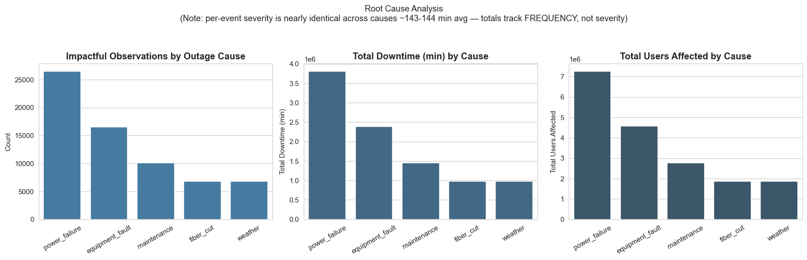
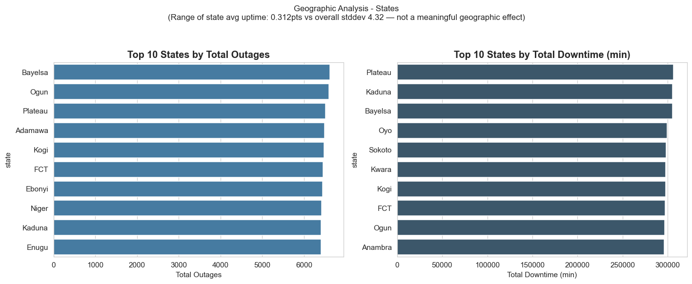
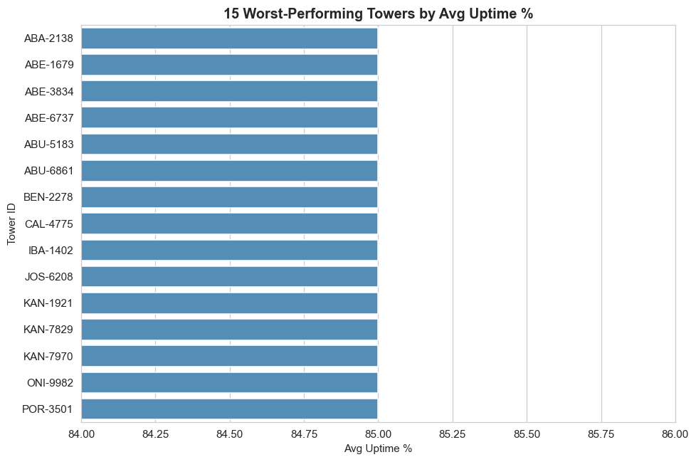
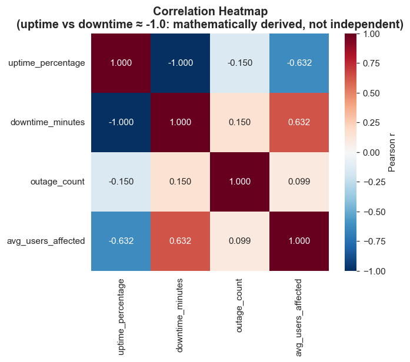
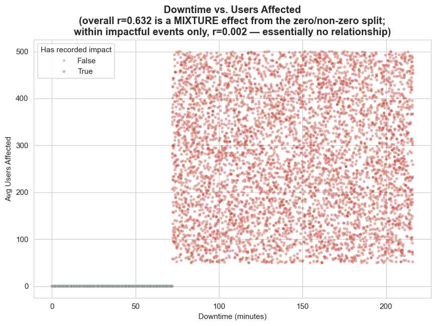
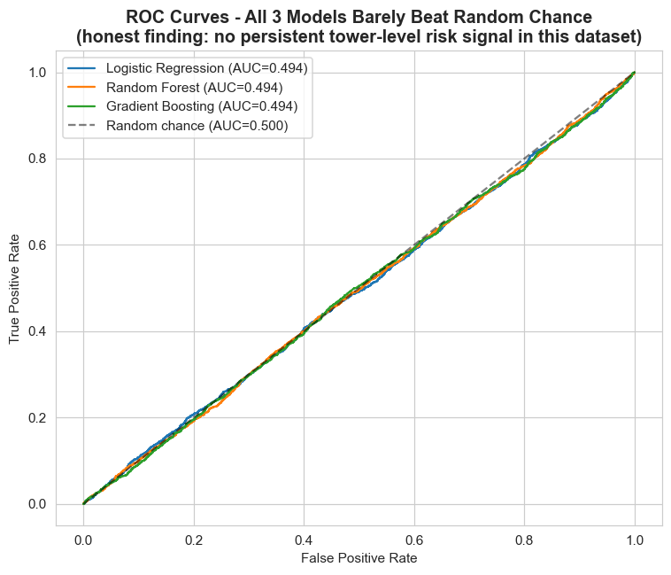
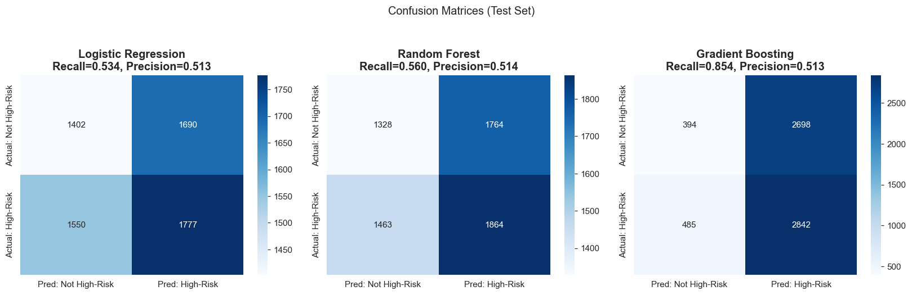

# 📡 AI-Powered Telecom Network Outage Analytics

An end-to-end telecom network analytics and machine learning project that investigates network outages, identifies operational and geographic risk patterns, evaluates tower performance, and develops predictive models to support proactive network reliability management.

## 🎯 Business Problem

Telecom network outages can lead to service disruption, customer dissatisfaction, revenue loss, and increased operational costs.

This project addresses the following business question:

> **What factors drive telecom network outages, which sites and regions are most vulnerable, and can we identify high-risk network sites so the company can proactively reduce downtime and improve service reliability?**

## 🚀 Project Objectives

The analysis focuses on:

- Identifying major drivers of network outages and downtime.
- Comparing network performance across operators and network types.
- Investigating geographic outage patterns across states and cities.
- Identifying poorly performing and high-risk telecom towers.
- Examining temporal patterns in network performance.
- Measuring relationships between downtime and operational impact.
- Engineering predictive features for tower-risk analysis.
- Applying machine learning to identify high-risk network sites.
- Producing an actionable tower-risk watchlist for proactive intervention.

## 🛠️ Technology Stack

| Technology | Application |
|---|---|
| SQL | Data validation, transformation and exploratory analysis |
| PostgreSQL | Relational database and SQL analysis |
| Python | Data analysis, EDA, feature engineering and modeling |
| Pandas / NumPy | Data manipulation and numerical analysis |
| Matplotlib / Seaborn | Analytical visualizations |
| Scikit-learn | Machine learning and model evaluation |
| VS Code | Development environment |
| Git / GitHub | Version control and portfolio presentation |

## 🔄 Analytics Workflow

The project follows an end-to-end analytics and data science workflow:

**Raw Network Data → Data Validation → SQL Analysis → Data Cleaning → Python EDA → Feature Engineering → Machine Learning → Risk Classification → Tower Watchlist → Business Recommendations**

## 🗄️ SQL Analysis

SQL was used to investigate and prepare telecom network performance data.

Key analytical areas include:

- Dataset validation and quality checks
- Missing-value investigation
- Duplicate detection
- Outage and downtime analysis
- Operator performance comparison
- Network-type comparison
- Root-cause analysis
- Geographic analysis
- Tower-level performance analysis
- Time-based network trends

📄 [View SQL Analysis](sql/SQL_Telecom_Outage_Analysis.sql)

## 🐍 Python Exploratory Data Analysis

Python was used for deeper exploratory analysis, visualization, feature engineering and predictive modeling.

The analysis includes:

- Univariate distributions
- Operator comparison
- Network-type comparison
- Root-cause analysis
- State-level geographic analysis
- City-level geographic analysis
- Worst-performing tower identification
- Daily temporal trends
- Monthly uptime analysis
- Correlation analysis
- Outlier investigation
- Downtime-versus-impact analysis

📄 [View Python Analysis](python/Python_Outage_EDA_Modeling.py)

## 🤖 AI & Machine Learning

Machine learning extends the descriptive analysis into predictive tower-risk analytics.

The modeling workflow includes:

- Feature engineering
- Risk-target preparation
- Training and test data preparation
- Predictive model development
- Model evaluation
- ROC curve analysis
- Confusion-matrix analysis
- High-risk tower identification

The objective is to support a shift from **reactive outage management** toward **proactive, data-driven network intervention**.

## 📊 Key Visualizations

### Root Cause Analysis


### Geographic Network Analysis


### Worst Performing Towers


### Correlation Analysis


### Downtime vs Operational Impact


### Machine Learning ROC Curves


### Model Confusion Matrices


## 🔍 Key Findings

The analysis produced several important operational and analytical findings:

- **Outage causes drive operational burden:** Outage categories differ substantially in total incident frequency, downtime, and users affected. This indicates that network reliability initiatives should prioritize causes based on their total operational impact rather than frequency alone.

- **Geographic differences are relatively small:** Although some states recorded higher total outage counts and downtime, the variation in average uptime across states was only about 0.312 percentage points compared with an overall standard deviation of approximately 4.32. This suggests that geography alone does not explain network reliability performance.

- **Specific towers require operational attention:** Tower-level analysis identified a group of consistently lower-uptime sites. These towers provide a practical starting point for targeted engineering investigation and preventive maintenance.

- **Downtime and uptime are mathematically dependent:** The correlation between uptime percentage and downtime minutes is approximately -1.0 because the two measures are mathematically derived from the same availability relationship. It should therefore not be interpreted as an independent causal relationship.

- **Customer impact requires contextual interpretation:** Across the full dataset, downtime and average users affected show a correlation of approximately 0.632. However, among observations with recorded customer impact, the relationship is approximately 0.002. The overall correlation is therefore largely influenced by the separation between zero-impact and non-zero-impact observations rather than a strong within-event relationship.

- **Current features provide weak predictive signal:** Logistic Regression, Random Forest, and Gradient Boosting produced ROC-AUC values of approximately 0.494, essentially equivalent to random discrimination.

- **High-risk recall alone is misleading:** Although some classification models achieved relatively high recall for the high-risk class, the ROC-AUC results show that this does not translate into reliable overall risk discrimination.

- **Predictive limitations are themselves a business finding:** The available historical variables are useful for descriptive network monitoring, but they are insufficient for reliable forward-looking tower-risk prediction.

## 💼 Business Recommendations

Based on the analytical findings, the following actions are recommended:

1. **Prioritize high-impact outage causes**  
   Allocate engineering resources using a combined view of outage frequency, total downtime, and users affected rather than relying on incident counts alone.

2. **Investigate persistently low-uptime towers**  
   Use the worst-performing tower list as an operational watchlist for site inspections, preventive maintenance, power-system checks, transmission diagnostics, and equipment-health reviews.

3. **Implement tower-level reliability monitoring**  
   Track uptime, downtime, outage frequency, customer impact, and recurring root causes at individual tower level to detect deterioration before service reliability becomes critical.

4. **Strengthen root-cause data collection**  
   Capture more detailed information on equipment failures, power availability, battery/generator status, transmission faults, maintenance history, weather conditions, congestion, site age, and repair response times.

5. **Do not operationalize the current ML models for automated risk decisions**  
   With ROC-AUC values around 0.494, the models do not demonstrate sufficient discriminatory power for reliable tower-risk prediction. They should remain experimental until stronger predictive features and temporal validation are available.

6. **Develop time-aware predictive datasets**  
   Future modeling should use historical observations to predict genuinely future outage outcomes. This will provide a more realistic test of whether emerging network deterioration can be detected in advance.

7. **Use analytics to support proactive maintenance**  
   Combine tower watchlists, outage-cause analysis, geographic monitoring, and engineering domain knowledge to move network operations from reactive fault resolution toward preventive intervention.

   ## 📊 Business Summary

This project demonstrates how SQL, Python, exploratory data analysis, statistical analysis, visualization, and machine learning can be integrated into an end-to-end telecom network reliability workflow.

The descriptive analysis successfully identifies operational patterns in outage causes, geographic performance, tower reliability, downtime, and customer impact. These findings provide actionable information for maintenance prioritization and network performance monitoring.

The machine-learning phase produced an equally important result: the available features do not contain sufficient persistent tower-level signal for reliable high-risk classification. All three evaluated models achieved ROC-AUC values of approximately 0.494.

Rather than overstating predictive performance, the project uses this result to identify a data-quality and feature-engineering requirement for future predictive maintenance systems.

From a business perspective, the strongest immediate value lies in **root-cause prioritization, tower-level performance monitoring, targeted maintenance, and improved operational data collection**. More advanced predictive deployment should follow only after richer temporal, infrastructure, environmental, and maintenance data become available.

## 🏁 Conclusion

The AI-Powered Telecom Network Outage Analytics project provides an end-to-end framework for transforming network operational data into reliability intelligence.

The analysis identifies outage patterns, evaluates geographic and tower-level performance, examines customer impact, and tests whether historical network characteristics can reliably identify high-risk towers.

The results show that descriptive analytics can already support operational decision-making, particularly through root-cause prioritization and identification of lower-performing towers. However, the machine-learning experiments demonstrate that the current dataset does not provide sufficient predictive separation for dependable tower-risk classification.

This is an important analytical outcome: a responsible AI solution should recognize when available data cannot support reliable prediction.

The recommended next stage is therefore to strengthen the data foundation with maintenance history, equipment condition, power-system reliability, weather, traffic load, infrastructure age, transmission performance, and temporal outage history. These variables can then be evaluated using time-aware validation to determine whether a deployable early-warning model can be developed.

Overall, the project demonstrates a complete analytics workflow from **data preparation → SQL analysis → exploratory analysis → visualization → machine learning → model evaluation → business interpretation → operational recommendations**.

## 📁 Repository Structure

```text
ai-powered-telecom-network-outage-analytics/
│
├── data/
│   ├── base_station_uptime_logs_clean.csv
│   ├── telecom_outage_features.csv
│   ├── telecom_tower_summary.csv
│   └── tower_risk_watchlist.csv
│
├── sql/
│   └── SQL_Telecom_Outage_Analysis.sql
│
├── python/
│   └── Python_Outage_EDA_Modeling.py
│
├── documentation/
│   └── Telecom_Network_Outage_Analytics.docx
│
├── visualizations/
│   ├── 01_univariate_distributions.png
│   ├── 02_operator_comparison.png
│   ├── 03_network_type_comparison.png
│   ├── 04_root_cause_analysis.png
│   ├── 05_state_geographic_analysis.png
│   ├── 06_city_geographic_analysis.png
│   ├── 07_worst_performing_towers.png
│   ├── 08_daily_time_trends.png
│   ├── 09_monthly_uptime_caveated.png
│   ├── 10_correlation_heatmap.png
│   ├── 11_outlier_boxplots.png
│   ├── 12_downtime_vs_impact_scatter.png
│   ├── 13_roc_curves.png
│   └── 14_confusion_matrices.png
│
└── README.md
